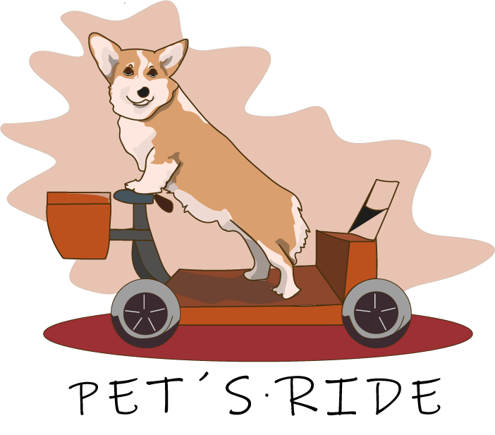

# Pets Ride
Proyecto en curso, comenzado por la asignatura de "Innovación Tecnológica". Aplicación móvil de ventas de servicios y productos para mascotas.

 ## Equipo

* [Jorge Armando Canche Tintore.](https://github.com/ArmandoCanche)
* [Luis Manuel Lagunez Rodríguez.](https://github.com/LuisLagunez)
* [Luis Javier Quintana Olivera.](https://github.com/Luis-J-Quintana)
* [Leticia del Carmen Tejero Gamboa.](https://github.com/LeticiaTejeroGamboa2401)

## Descripción General
Este repositorio contiene el progreso del proyecto **Pets Ride**. Comenzado como un proyecto integrador para la asignatura **Innovación Tecnológica** impartida en el séptimo semestre de la licenciatura en Ingeniería de Software de la Universidad Autónoma de Yucatán, vinculación con la Unidad Multidisciplinaria Tizimín. El proyecto pretende servir como una aplicación móvil de ventas de servicios y productos para mascotas.

## ¿Qué es Pets Ride?
Pets Ride es una aplicación móvil diseñada para revolucionar el cuidado de las mascotas, conectando a sus dueños con una red confiable de servicios especializados. Desde transporte y cuidado veterinario hasta hospedaje, educación y adiestramiento, Pets Ride facilita el acceso a servicios personalizados que promueven el bienestar y la felicidad de tus compañeros peludos. Nuestra misión es ser el aliado de confianza que hace del cuidado de tus mascotas una experiencia más sencilla, segura y tecnológica.

## Objetivo General
Facilitar y optimizar el acceso a servicios integrales para el cuidado de mascotas a través de una plataforma tecnológica que priorice la confianza, la seguridad y la satisfacción del cliente.

## Características Principales de la Aplicación

### Servicios Disponibles
- Transporte especializado para mascotas.
- Conexión con veterinarios certificados.
- Hospedaje y cuidado temporal.
- Adiestramiento personalizado.
- Recursos educativos para dueños responsables.

### Funciones Tecnológicas
- Geolocalización en tiempo real para servicios de transporte.
- Evaluaciones y reseñas de proveedores.
- Notificaciones personalizadas sobre salud y bienestar.
- Plataforma amigable para agendar y pagar servicios desde la app.

## Índice
### IT
* [Misión, visión y valores.](Misión-Visión-Valores.pdf)
* [Logo](logo.png)
* [Modelo de negocio](Modelo-Negocio.pdf)
* [FODA](FODA.png)
* [Ventaja-Competitiva](Ventaja-Competitiva.pdf)

## Colaboradores

## Herramientas y Tecnologías

