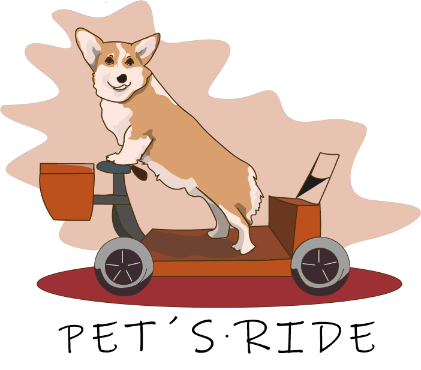

# 🐾 Pet's Ride
Iniciado en la asignatura de **"Innovación Tecnológica"**, continuado en la asignatura **"Administración de Proyectos I"** y finalizado en la asignatura de **"Administración de Proyectos II"**. Una aplicación web para ventas de servicios y productos para mascotas.

## 🌟 Descripción General
Este repositorio contiene el progreso del proyecto **Pet's Ride**. Comenzado como un proyecto integrador para la asignatura **Innovación Tecnológica** impartida en el séptimo semestre de la licenciatura en Ingeniería de Software de la Universidad Autónoma de Yucatán, vinculación con la Unidad Multidisciplinaria Tizimín. El proyecto pretende servir como una aplicación web de ventas de servicios y productos para mascotas.

## 🐶📱 ¿Qué es Pet's Ride?
Pet's Ride es una aplicación web diseñada para revolucionar el cuidado de las mascotas, conectando a sus dueños con una red confiable de servicios especializados. Desde transporte y cuidado veterinario hasta hospedaje, educación y adiestramiento, Pet's Ride facilita el acceso a servicios personalizados que promueven el bienestar y la felicidad de tus compañeros peludos. Nuestra misión es ser el aliado de confianza que hace del cuidado de tus mascotas una experiencia más sencilla, segura y tecnológica.

## 🎯 Objetivo General
Facilitar y optimizar el acceso a servicios integrales para el cuidado de mascotas a través de una plataforma tecnológica que priorice la confianza, la seguridad y la satisfacción del cliente.

## 🚀 Características Principales de la Aplicación

###  🛠 Servicios Disponibles
- **Transporte especializado** para mascotas.
- Conexión con **veterinarios certificados**.
- **Hospedaje** y cuidado temporal.
- **Adiestramiento personalizado**.
- Recursos educativos para dueños responsables.

### 📱 Funciones Tecnológicas
- **Geolocalización en tiempo real** para servicios de transporte.
- **Evaluaciones y reseñas** de proveedores.
- **Notificaciones personalizadas** sobre salud y bienestar.
- Plataforma amigable para **agendar y pagar servicios** desde la app.

## Índice

### 📂 Documentos de planeación.
* [Modelo de Negocio](Documentos/Modelo-Negocio.pdf)
* [Ventaja Competitiva](Documentos/Ventaja-Competitiva.pdf)
* [Caso de Negocio](Documentos/Business_Case.pdf)
* [Documento de Factibilidad](Documentos/DocumentodeFactibilidad.pdf)
* [Charter](Documentos/CharterPets'Ride.pdf)
* [Propuesta](Documentos/Propuesta.pdf)
* [ERS](Documentos/ERS_PetsRide.pdf)

### 📂 Documentos de planes subsidiarios, líneas base, costos y cronogramas.
* [Cronograma del proyecto](Documentos/Cronograma.pdf)
* [Plan de gestión de costes y línea base de costes](Documentos/Plan-Gestión-Costes-LineaBaseCostes.pdf)
* [Plan de gestión de riesgos](Documentos/PlanGestionRiesgos.pdf)
* [Plan de gestión de configuración y de cambios](Documentos/Plan-Gestión-Configuracion-Y-Cambios.pdf)
* [Plan de gestión de recursos humanos](Documentos/PlanGestionRecursosHumanos.pdf)
* [Plan de evaluación de desempeño](Documentos/PlanEvaluacionDesempeño.pdf)
* [Plan de despliegue](Documentos/PlanDespliegue.pdf)
* [Plan de aceptación](Documentos/PlanAceptacion.pdf)

### 📂 Informe de cierre y manuales
* [Manual de usuario](Documentos/Manual-Usuario.pdf)
* [Manual técnico](Documentos/Manual-Tecnico.pdf)
* [Informe de Cierre](Documentos/Informe-Cierre-del-Proyecto.pdf)
* [Repositorio del proyecto desarrollado](https://github.com/ArmandoCanche/Pets-Ride-App)

## Colaboradores

## Herramientas y Tecnologías

